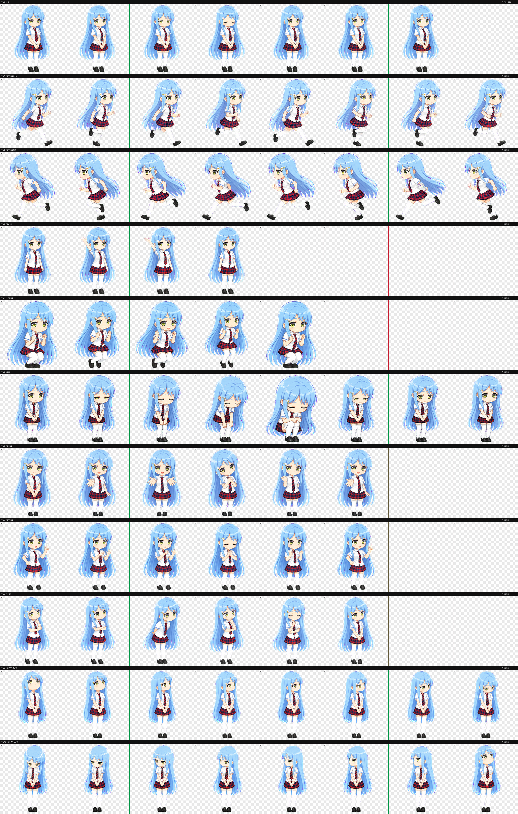

# 沢渡雫

这是为 Deeptop 制作的个人非商业同人桌宠样品，不是官方素材或授权商品。角色精灵根据公开外观特征重新生成，没有裁切或打包官方立绘；角色及作品相关权利归原权利人所有。



这个版本采用 Deeptop Pet 的 8×11 图集：包含九组任务与互动动画，以及 16 个连续注视方向。注视动作保持统一的头身比例和脚底基线，小雏菊始终固定在角色自身右太阳穴，不会随方向切换到另一侧。单击、双击、长按、拖动和空闲动作由 Deeptop 的安全声明式交互映射驱动，宠物包不包含或执行脚本。

构建本地可导入文件：

```shell
npm run pet:pack -- examples/pets/sawatari-shizuku
```

在取得相关权利许可前，请勿将本样品用于宠物市场公开分发、商业销售或官方宣传。外观参考与使用边界记录在 `reference-notes.md`。
