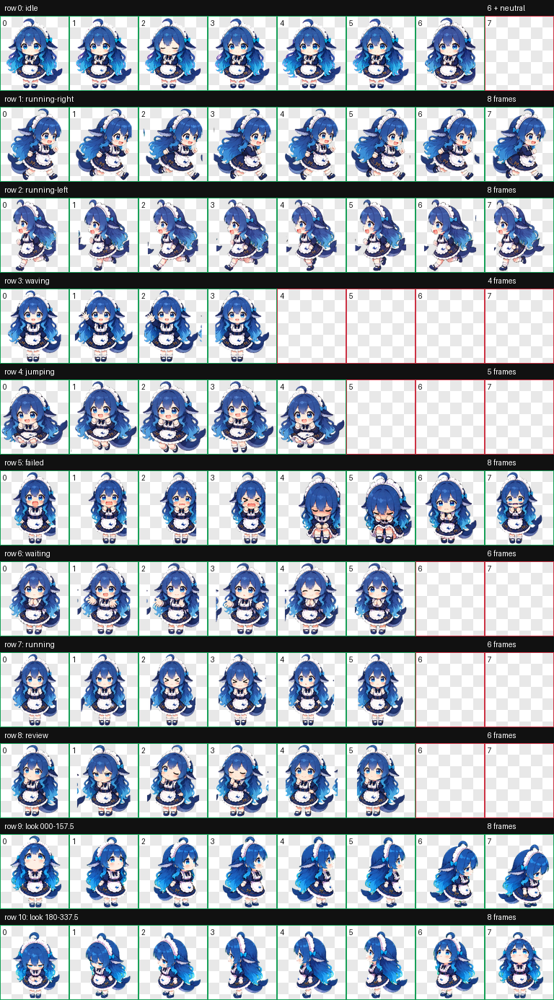

# 鲸鱼娘

这是一个面向 Deeptop 的非官方社区鲸鱼娘桌宠样品。当前造型使用渐变蓝色长发、头顶呆毛、两侧鲸鳍、深海军蓝裙装、白色荷叶边围裙和鲸尾，替换了旧样品的短卷发与亮蓝短裙造型。



这个版本采用 Deeptop Pet 的 8×11 图集：包含待机、左右移动、挥手、跳跃、失败、等待输入、执行任务和完成审查九组动画，以及 16 个连续注视方向。单击会挥手，双击会跳跃，长按会回应；拖动时使用对应方向的跑动，空闲时会注视全局鼠标位置。任务状态仍由 Deeptop 主窗口驱动，不执行宠物脚本。

构建可导入文件：

```shell
npm run pet:pack -- examples/pets/whale-maid
```

## 素材来源与许可

`spritesheet.webp` 以 [f0909172434/dsh-deepseek-girl-pet](https://github.com/f0909172434/dsh-deepseek-girl-pet) 发布的社区图集为基础，上游以 MIT License 发布，版权所有 © 2026 f0909172434。Deeptop 保留其移动、交互、任务状态和注视动作，只替换待机行的六帧动画，去除原素材内嵌的对话气泡、文字和手持牌。当前文件的 SHA-256 为 `BAF6CCE3D6E789C639E92C8DFF433D31E7B5350BBAFA4AA2643F68C2D5E295CA`。

社区常见鲸鱼娘设计的署名脉络为：[上善](https://www.pixiv.net/users/62155430)创作原始鲸鱼娘形象，[ZipZipPipe](https://www.pixiv.net/users/18604994)在其基础上加入 DeepSeek 元素并设计女仆版本。相关公开衍生项目另见 [Small-tailqwq/dsh-deep-whale](https://github.com/Small-tailqwq/dsh-deep-whale)。本样品是非官方社区作品，与 DeepSeek、Pixiv 或上述创作者不存在隶属、合作或背书关系。
